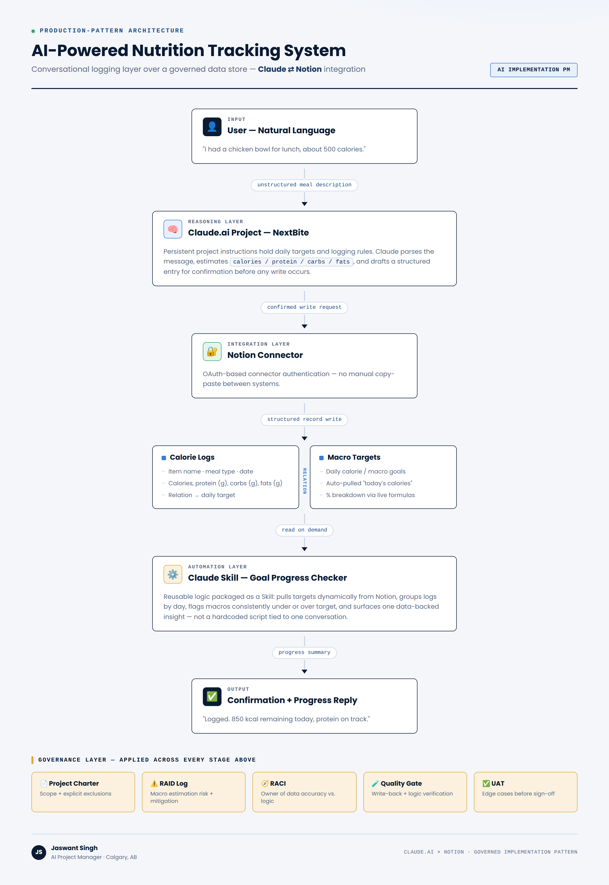
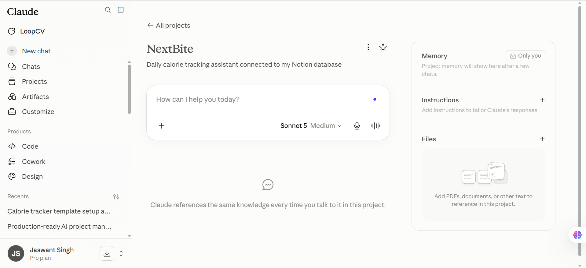
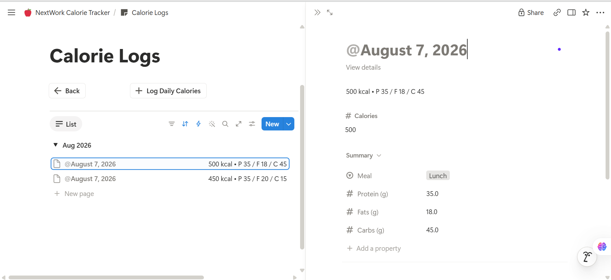
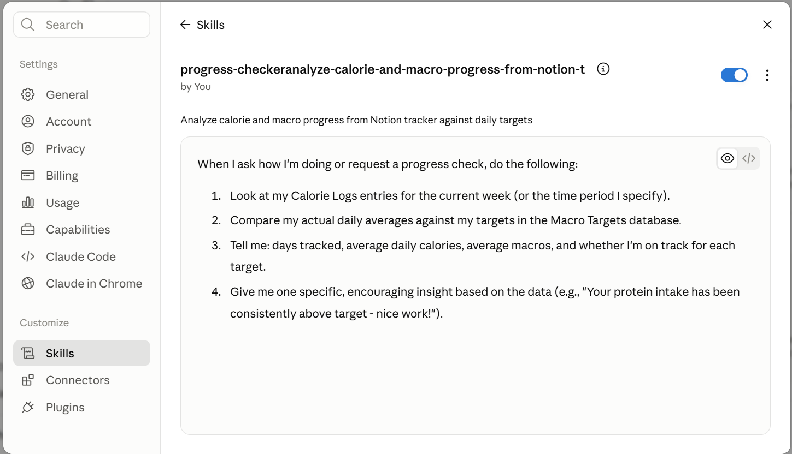
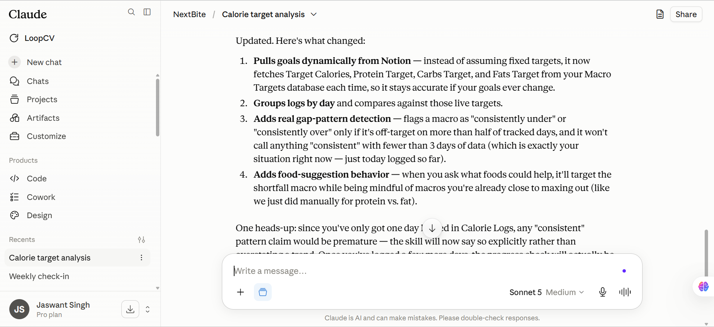

# AI-Powered Nutrition Tracking System

**Conversational meal logging built on Claude + Notion, run with production AI implementation discipline.**

---

## Overview

This project connects **Claude.ai** to a **Notion** database so meals can be logged through plain conversation instead of manual form entry. Claude parses natural-language meal descriptions, estimates macros, writes structured records to Notion through an authenticated connector, and a packaged **Claude Skill** compares logged intake against daily targets on demand.

The build itself is a small, well-scoped system. What this repo documents is **how it was run**: as a scoped implementation with a charter, a risk log, an ownership map, a quality gate, and a UAT pass — the same discipline I'd apply to a production AI rollout, at a scale small enough to execute and document end to end in a single sitting.

📄 Read the full breakdown: [`docs/project-charter.md`](docs/project-charter.md)

---

## Architecture

The system has four layers, plus a governance layer that applies across all of them:

| Layer | Component | Responsibility |
|---|---|---|
| Input | User (natural language) | Describes a meal in plain conversation |
| Reasoning | Claude.ai Project (`NextBite`) | Parses input, estimates macros, drafts a structured entry against persistent project instructions |
| Integration | Notion Connector | OAuth-based write-back — no manual copy-paste |
| Data | Notion — `Calorie Logs` + `Macro Targets` | Related databases; daily totals computed via live formulas, not duplicated fields |
| Automation | Claude Skill — `Goal Progress Checker` | Reusable logic that pulls targets dynamically, groups logs by day, and flags macros under/over target on request |

Full interactive version: [`architecture/architecture.html`](architecture/architecture.html)

---

## Deliverables

This repo documents the same artifact set I'd expect to produce on a client-facing AI implementation engagement:

| Artifact | Purpose |
|---|---|
| [Project Charter](docs/project-charter.md) | Scope, explicit exclusions, success criteria |
| [RAID Log](docs/raid-log.md) | Risks, assumptions, issues, dependencies — and mitigations |
| [RACI Matrix](docs/raci-matrix.md) | Ownership across data accuracy, logic, and rollout |
| [Quality Gate Scorecard](docs/quality-gate-scorecard.md) | Pass/fail criteria before calling the build "done" |
| [UAT Checklist](docs/uat-checklist.md) | Edge cases tested before sign-off |
| [Skill Spec](skill/goal-progress-checker-skill.md) | Trigger conditions, logic, and output format for the packaged Skill |

---

## Build Walkthrough (Screenshots)

| Step | Screenshot | What it shows |
|---|---|---|
| 1 | [`01-notion-connector-setup.png`](screenshots/01-notion-connector-setup.png) | Notion connector authenticated in Claude.ai — integration layer live |
| 2 | [`02-database-structure-review.png`](screenshots/02-database-structure-review.png) | Claude reviewing the tracker template structure before customization |
| 3 | [`03-macro-targets-database.png`](screenshots/03-macro-targets-database.png) | `Macro Targets` database — daily goals with live formula fields |
| 4 | [`04-nextbite-project-overview.png`](screenshots/04-nextbite-project-overview.png) | The `NextBite` Claude Project — dedicated workspace for this system |
| 5 | [`05-persistent-project-instructions.png`](screenshots/05-persistent-project-instructions.png) | Persistent project instructions — targets, logging rules, database structure |
| 6 | [`06-calorie-logs-database.png`](screenshots/06-calorie-logs-database.png) | `Calorie Logs` database — a logged entry with meal type and macros |
| 7 | [`07-goal-progress-checker-skill.png`](screenshots/07-goal-progress-checker-skill.png) | The packaged `Goal Progress Checker` Skill definition |
| 8 | [`08-skill-refinement-session.png`](screenshots/08-skill-refinement-session.png) | Skill refinement — fixing the hardcoded-targets and false-pattern-claim issues (RAID log I1–I2) |

  
  

  
  

---

## Tech Stack

- **Claude.ai** — reasoning layer, Claude Projects (persistent instructions), Claude Skills
- **Notion** — data layer, relational database design, formula fields
- **Notion Connector (OAuth)** — integration layer between Claude and Notion

---

## What This Demonstrates

- Structuring a lightweight relational data model (two related databases, computed fields, no duplication)
- Designing a natural-language interface layer that maps unstructured input to structured writes
- Packaging repeatable logic as a Skill rather than one-off conversational instructions
- Running a small AI implementation with the same governance discipline used on larger rollouts: charter → risk log → RACI → quality gate → UAT

---

## Scope Note

This was a self-directed, hands-on build (~1–2 hours), not a client engagement — the governance artifacts in this repo reflect the process I applied to it, written up to the same standard I'd use professionally. Framing is intentionally explicit about that distinction; nothing here claims production deployment at scale.

---

## Author

**Jaswant Singh** — AI Project Manager, Calgary, AB
PMP · AWS Certified AI Practitioner · [GitHub](https://github.com/JaswantOnGit)
